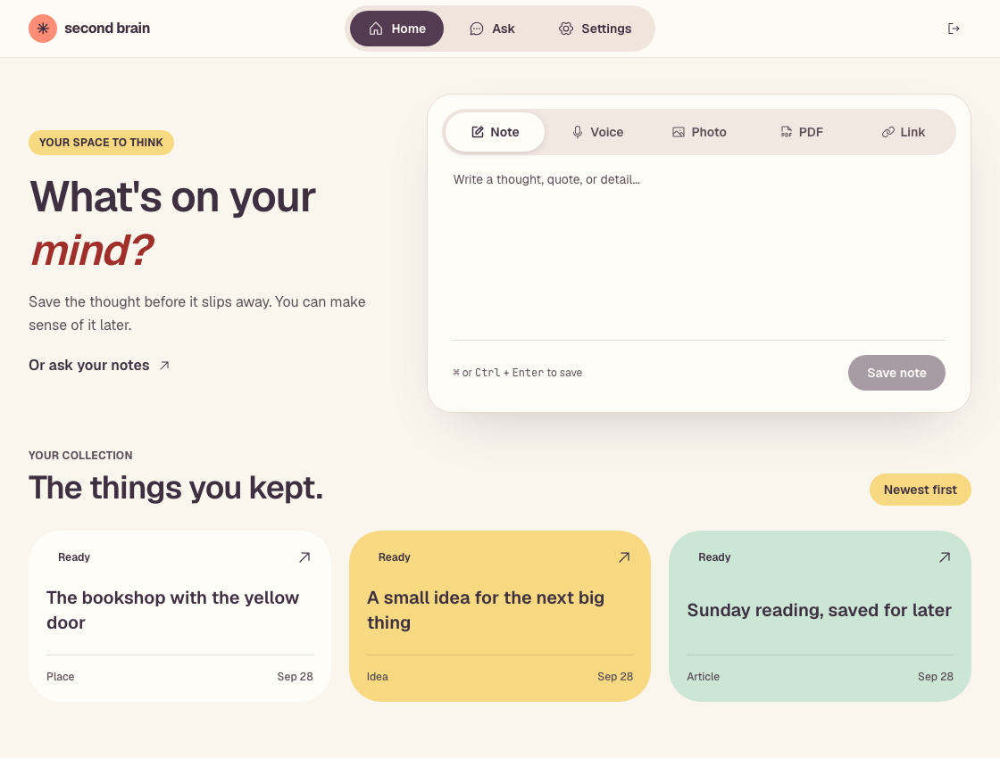
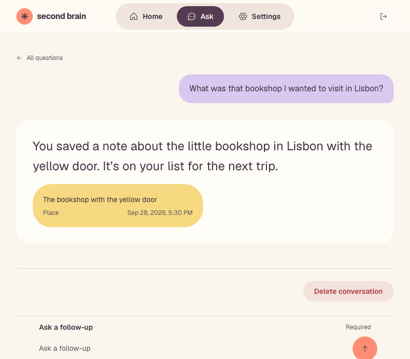

# Second Brain

**Save anything. Then just ask.**


A personal memory system. Drop in a note, a voice memo, a photo, a PDF, or a link — including YouTube videos and Instagram Reels — in under three seconds, from any device. Weeks later, ask for it back in plain language and get one direct answer: the exact thing you saved, verbatim, with a link to its source. Not a generated summary of your notes — the real thing, every time.

**[Try it live →](https://second-brain-sigma-green-70.vercel.app)**



## Why it's built this way

- **A capture never fails.** The raw item — text, audio, image, file — is stored the instant it arrives, before any processing starts. A paywalled article or a video with no transcript still gets saved and stays searchable; it's marked `partial` instead of being dropped.
- **Answers cite their source, always.** Ask a question and get back quotes, facts and names exactly as you saved them — never paraphrased — each one linked to the item it came from. Nothing in range of what you saved? It says so instead of guessing.
- **Five formats, one pipeline.** Notes, voice recordings, photos, PDFs, and links — articles, YouTube, Instagram — all land in the same place and are askable the same way.
- **Your AI key, your AI bill.** Second Brain runs on an OpenRouter key you provide in Settings. Nothing runs on a shared pool, nothing is billed to a company you don't control.
- **A browser extension for what the web app can't reach.** One click, `Alt+S`, or right-click a page — even logged-in or paywalled ones — to save it straight from the tab you're reading. ([Not yet on the Chrome Web Store](#run-the-browser-extension) — build it from source today.)



Full product and pipeline spec: [`docs/spec.md`](docs/spec.md). Decision history: [`docs/adr/`](docs/adr/).

## Run it yourself

Second Brain is MIT-licensed. Clone it, point it at your own Postgres, Cloudflare, and OpenRouter accounts, and it's a fully working instance.

### Prerequisites

- [Bun](https://bun.sh) 1.3
- Docker (local Postgres + pgvector)
- An [OpenRouter](https://openrouter.ai) API key — required; this is what runs the capture pipeline and Ask.

### Setup

```bash
bun install
cp .env.example .env                              # set POSTGRES_PASSWORD; every other URL derives from it
cp apps/web/.env.example apps/web/.env             # WORKER_ORIGIN — where the web app's /api proxy forwards to
cp apps/api/.dev.vars.example apps/api/.dev.vars   # Worker secrets for local dev
docker compose up -d --wait                        # Postgres 17 + pgvector on :5432
bun run db:migrate                                  # apply migrations to the local database
bun run dev                                         # web on :3000, api on :8787
```

Open http://localhost:3000, sign up, add your OpenRouter key in Settings, and start capturing. Confirm the API and database are reachable at http://localhost:3000/status.

Only `BETTER_AUTH_SECRET` and `KEY_ENCRYPTION_SECRET` are required in `apps/api/.dev.vars`. `YOUTUBE_API_KEY`, `TRANSCRIPT_API_KEY`, `READER_API_KEY`, and Google sign-in credentials are optional operator-paid fallbacks (see [ADR-0006](docs/adr/0006-transcript-and-reader-run-on-operator-keys.md)) — without them, the affected capture is saved `partial` instead of failing.

### Database migrations

Migrations live in `packages/db/drizzle`. After changing `packages/db/src/schema.ts`:

```bash
cd packages/db && bunx drizzle-kit generate --name=<change>
```

Migrations are applied programmatically (`@workspace/db/migrate`); `drizzle-kit push` is never used because it drops HNSW operator classes.

### Run the browser extension

```bash
bun run --cwd apps/extension build
```

Load `apps/extension/dist` as an unpacked extension at `chrome://extensions` → Developer mode → Load unpacked. The listing isn't live on the Chrome Web Store yet, so this is currently the only way to run it.

### Deploying

The hosted instance runs `apps/web` on Vercel and `apps/api` as a Cloudflare Worker (`apps/api/wrangler.jsonc`), backed by Neon Postgres. Architecture and provider choices: [`docs/spec.md §9`](docs/spec.md#9-architecture). There's no scripted one-command production deploy yet — treat this as a local-dev setup until that exists.

## Repository layout

```
apps/web         Next.js UI (Vercel)
apps/api         Hono on Cloudflare Workers: HTTP API, queue consumer, workflows
apps/extension   Browser extension (WXT): Chrome, built from the same codebase as Firefox
packages/db      Drizzle schema, migrations, database access (Neon Postgres + pgvector via Hyperdrive)
packages/ai      OpenRouter client (chat with structured output, embeddings) on a caller-supplied key
packages/ui      shadcn/ui components
```

Each package is a deep module: import only from the root of its `src/` (or the entry points its `package.json` exports). `bun run lint:boundaries` enforces this.

## Checks

```bash
bun run check    # lint, typecheck, boundaries, tests across every workspace
```

Tests run against a real Postgres: each suite provisions its own database on the local server. `apps/api` tests run inside the Workers runtime through `@cloudflare/vitest-plugin` (pinned to Vitest 4 until the plugin supports Vitest 5).

The pre-commit hook runs Prettier, ESLint and typecheck; commit messages follow [Conventional Commits](https://www.conventionalcommits.org) and are enforced by commitlint. Every change goes through a branch and a squash-merged PR — see [`AGENTS.md`](AGENTS.md).

## Releases

Every `master` commit carrying a `feat`, `fix`, or breaking change keeps a release PR up to date via [release-please](https://github.com/googleapis/release-please). Merging that PR tags the version, writes the changelog, and publishes a [GitHub Release](https://github.com/Divy97/second-brain/releases) — no manual tagging.

## License

[MIT](LICENSE)
